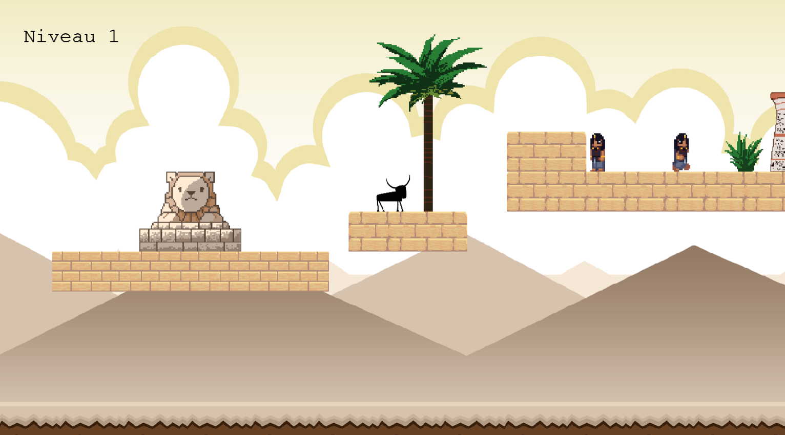

# Apistache

Apistache est un jeu vidéo 2D à visée de médiation scientifique. Ce projet a été développé dans le cadre du cours _Développement de jeux vidéo 2D_ dispensé par Isaac Pante (SLI, Lettres, UNIL).

### Synopsis

Égypte, Memphis. 652 avant notre ère... Vous êtes un taureau et souhaitez poursuivre votre vie dans les meilleures conditions qui soient pour vous : vous souhaitez devenir un taureau Apis, incarnation terrestre du dieu Ptah ! Vous pourriez ainsi terminer votre vie dans les plus grands honneurs, aux soins des prêtres... Pour cela, il vous faut récupérer les attributs caractéristiques des taureaux Apis. Avant d'avoir réuni ces attributs, ne vous faites pas attraper par les prêtres, ou vous finirez sacrifié !

## Librairies

Apistache a été développé en javascript, à l'aide de la libraire Kaboom.js v3000.0.

## Lancement

Le jeu tourne bien sur l'extension LiveServer.